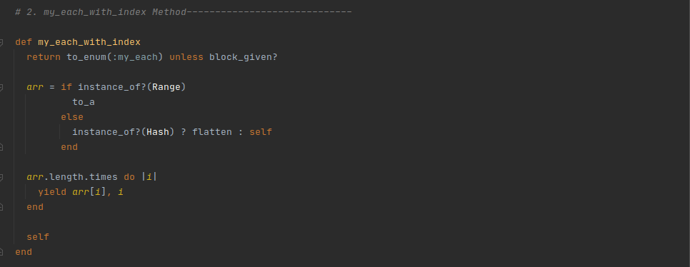

# Enumerable-Methods

This is the first project that challenges us into recreating our own enumerable methods using Ruby this is the second Ruby section of the *Microverse Remote Software Development Curriculum*.

Below are a list of methods we had to recreate.

### Enumerable Methods List:

- my_each
  
  
- my_each_with_index
  
  
- my_select
  
  
- my_all?
  
  
- my_any?
  
  
- my_none?
  
  
- my_count
  
  
- my_map
  
  
- my_inject
  
  
- multiply_els
  

## Built With

- Ruby

## Live Code
[Solution](https://repl.it/@Ralph0/Enumerable-Methods#enumerables.rb)
[](https://repl.it/@Acushla/Enumerable)


## Getting Started

To get a local copy of the repository please run the following commands on your terminal:

```
$ cd <folder>
```

```
$ git clone https://github.com/KumarAmitt/Enumerable-Methods/tree/feat
```

Testing

To test the code, run `rspec` from root of the folder using terminal.
> Rspec is used for the test.

~~~bash
$ gem install rspec
~~~


## Authors

👤 **Amit Kumar**

- GitHub: [@githubhandle](https://github.com/KumarAmitt)
- Twitter: [@twitterhandle](https://twitter.com/ArrshAmitt)
- LinkedIn: [LinkedIn](https://www.linkedin.com/in/kumar-amitt)


👤 **Ralph Oburu**

- GitHub: [Ralph-1](https://github.com/Ralph-1)
- Twitter: [@twitterhandle](https://twitter.com/NotRalph0)
- LinkedIn: [LinkedIn](www.linkedin.com/in/ralph-oburu-092a561b1)


## 🤝 Contributing

Contributions, issues and feature requests are welcome!


## Show your support

Give a ⭐️ if you like this project!


## Acknowledgments

- Project originally taken from The Odin Project
- Project inspired by Microverse Program

## 📝 License
&copy; 2020 Amit Kumar & Ralph

Permission is hereby granted, free of charge, to any person obtaining a copy
of this software and associated documentation files (the "Software"), to deal
in the Software without restriction, including without limitation the rights
to use, copy, modify, merge, publish, distribute, sublicense, and/or sell
copies of the Software, and to permit persons to whom the Software is
furnished to do so, subject to the following conditions:

The above copyright notice and this permission notice shall be included in all
copies or substantial portions of the Software.

THE SOFTWARE IS PROVIDED "AS IS", WITHOUT WARRANTY OF ANY KIND, EXPRESS OR
IMPLIED, INCLUDING BUT NOT LIMITED TO THE WARRANTIES OF MERCHANTABILITY,
FITNESS FOR A PARTICULAR PURPOSE AND NONINFRINGEMENT. IN NO EVENT SHALL THE
AUTHORS OR COPYRIGHT HOLDERS BE LIABLE FOR ANY CLAIM, DAMAGES OR OTHER
LIABILITY, WHETHER IN AN ACTION OF CONTRACT, TORT OR OTHERWISE, ARISING FROM,
OUT OF OR IN CONNECTION WITH THE 